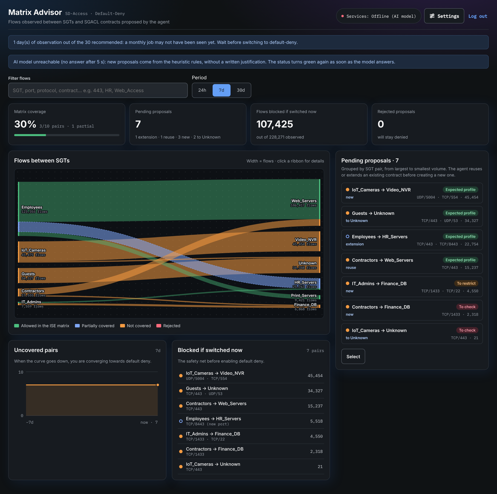
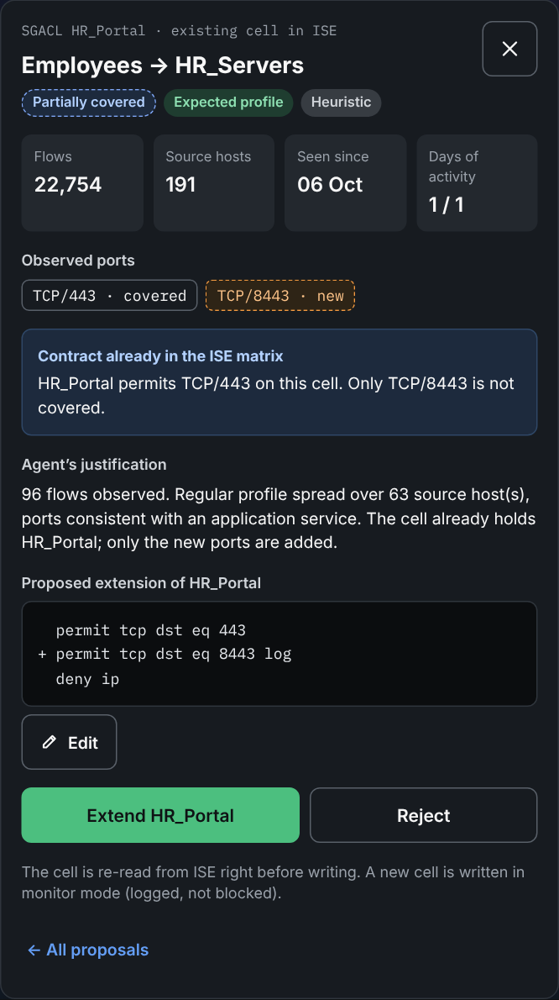
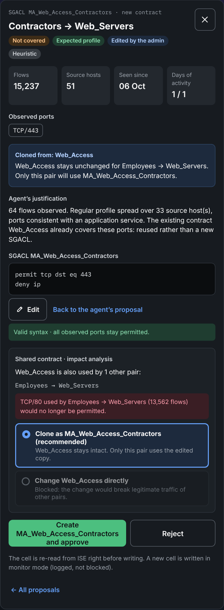
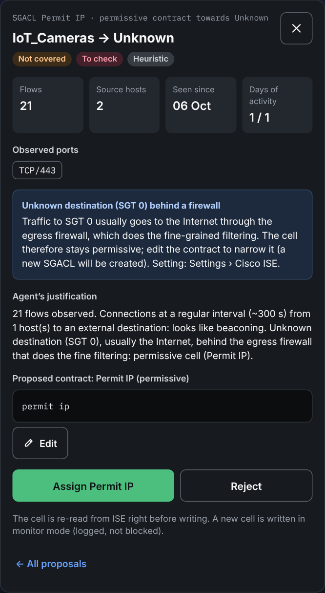
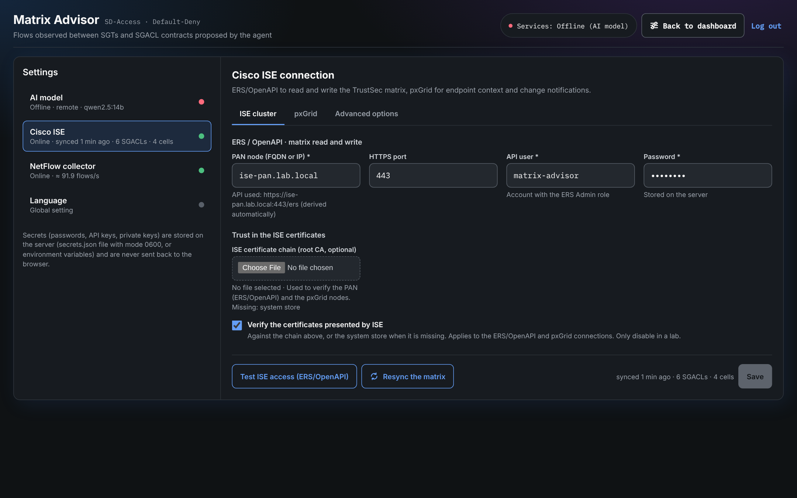
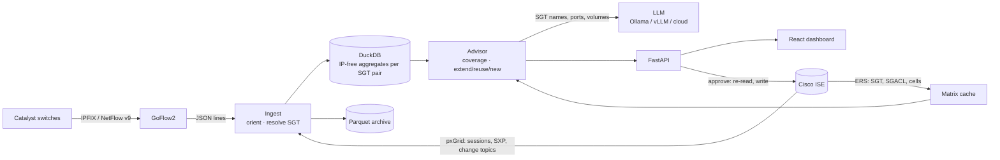

# Matrix Advisor

**AI-assisted TrustSec matrix builder for moving Cisco SD-Access to default-deny.**

Matrix Advisor watches the traffic that actually flows between Security Group Tags (from
NetFlow/IPFIX), compares it with the TrustSec matrix configured in Cisco ISE, and proposes the
SGACL contracts needed so that legitimate traffic keeps flowing once the matrix default is
switched to `deny ip`. An administrator reviews every proposal before anything is written to ISE.

Companion project of the Cisco Live session **BRKENS-3810 — How to Adopt Zero Trust using
SD-Access and Default-Deny without Tears**.

> Status: MVP. Tested against the bundled ISE simulator and GoFlow2; validate against your own
> ISE version in a lab before pointing it at production.



---

## What it does

- **Learns the real traffic matrix.** Switches export NetFlow v9/IPFIX to GoFlow2. Each flow is
  oriented (client → service port), attributed to source/destination SGTs (the group tags exported in
  the flow record when switches send them, otherwise pxGrid sessions, SXP/static bindings) and
  aggregated per SGT pair, protocol and port in DuckDB. The aggregates the advisor reads carry no
  address, so their size depends on the number of SGT pairs, not of hosts; per-host data is kept only
  for host counts and the beaconing test, folded to one row per address pair and day. Raw flows are
  archived to Parquet.
- **Compares with the ISE matrix.** SGTs, SGACLs and egress matrix cells are read from ISE (ERS API)
  and re-read periodically and on pxGrid change notifications. ISE stays the source of truth.
- **Proposes the smallest change.** For each SGT pair that default-deny would break, the engine:
  - **extends** the contract already on the cell when only a new port is missing;
  - **reuses** an existing contract that already covers the ports (preferring contracts already used
    towards the same destination group);
  - otherwise **creates** a least-privilege SGACL (`permit` per observed port, `deny ip` last).
- **Explains and scores risk.** A local LLM (Ollama, vLLM…) or a cloud model writes the justification
  and rates the risk. Deterministic heuristics (beaconing, database access from few hosts, off-hours,
  admin ports, scans) are a floor the model cannot lower, and the full answer when the model is offline.
- **Keeps a human in the loop.** Proposals are grouped per SGT pair on a dashboard (Sankey of flows,
  coverage, what would be blocked if you switched now). The admin approves, rejects or edits each one,
  or selects several pending proposals to approve or reject them in bulk.
- **Stays in sync with ISE.** A pxGrid notification or a burst of approvals leads to one debounced
  re-read of the matrix; the cell just written is re-read at once so the dashboard is exact for it.
- **Bilingual.** French or English for the whole application, agent justifications included.
- **Ready to operate.** HTTPS through a Caddy overlay, a Prometheus `/metrics` endpoint with alert
  rules (no flows, ingest backlog, UDP drops, ISE or pxGrid down) and scheduled backups
  ([docs/operations.md](docs/operations.md)).

## Tour of the dashboard

The top of the dashboard answers *can I switch to default-deny now?*: matrix coverage, pending
proposals by kind (extension, reuse, new, towards Unknown), how many observed flows the switch would
block, and rejected proposals. Below, a Sankey shows the flows between SGTs coloured by coverage
(allowed in the ISE matrix, partially covered, not covered, rejected), with a filter (SGT, port,
protocol, contract) and a 24 h / 7 d / 30 d period. *Uncovered pairs* tracks the convergence towards
default-deny, and *Blocked if switched now* lists what would break today.

Clicking a proposal or a ribbon opens the pair: observed ports, hosts and activity, the agent's
justification and risk, and the SGACL it proposes.

| Extend an existing contract | Edit a shared contract: forced clone | Beaconing towards Unknown |
| --- | --- | --- |
|  |  |  |
| `HR_Portal` already permits TCP/443 on the cell: only the new port 8443 is added. | `Web_Access` is shared with `Employees → Web_Servers`, which still uses port 80: the impact analysis blocks the in-place change and proposes the clone `MA_Web_Access_Contractors`. | Cameras reaching the Internet every 5 minutes: beaconing, rated high risk (*To check*). The egress firewall is on, so the cell would get `Permit IP`; edit it to narrow it down. |

The SGACL editor is locked until *Edit*; the syntax is checked as you type and the clone or in-place
choice appears only after *Confirm edit*. Every approval re-reads the cell from ISE before writing.

Settings live in the application (*Settings*): AI model, Cisco ISE (cluster, pxGrid, advanced
options), NetFlow collector and language, each page with its own test button and status line.



The screenshots come from the bundled demo (ISE simulator and traffic generator) with no LLM attached,
so justifications are the heuristic ones (badge *Heuristic*).

## Safety rules

| Rule | Why |
| --- | --- |
| IP addresses never reach the model | IP → SGT resolution happens before the LLM; every prompt is checked and refused if it contains an IPv4/IPv6 address. Even with a cloud model, only SGT names, ports and volumes leave the network. |
| Re-read before write | The cell is read again from ISE right before writing. If an admin changed it since the proposal, nothing is written and the UI offers to merge. |
| Shared contracts are cloned | Editing a contract used by other pairs creates a clone (`MA_<contract>_<source>`) unless an impact analysis proves that no observed traffic of the other pairs would be denied. |
| Monitor first | New cells are written in `MONITOR` status by default (`ise.write_mode: monitor`). Existing cells keep their status. |
| Ownership | Created SGACLs carry a configurable prefix (`MA_`) and a description pointing to the proposal. Every decision is in the audit log. |
| Learning phase | Nothing is proposed during the first `learning_days` (14 by default), so the admin gets a stable list instead of a stream. |
| Rare-flow guard | Proposals and impact analysis use the whole retained history (30 days), not just the last week. Pairs seen on only one or two days are flagged *Rare flow* and sent to review, and the dashboard warns until a full month of traffic has been observed. |

## Architecture



More detail in [docs/architecture.md](docs/architecture.md).

| Component | Tech |
| --- | --- |
| Flow collector | [GoFlow2](https://github.com/netsampler/goflow2) (NetFlow v9 + IPFIX, JSON file output) |
| Backend | Python 3.11+, FastAPI, DuckDB, httpx, websockets (pxGrid STOMP) |
| Frontend | React + TypeScript + Vite |
| LLM | Ollama, any OpenAI-compatible endpoint (vLLM, LM Studio), Anthropic, Azure OpenAI |
| Demo | ISE simulator (ERS, pxGrid REST and STOMP pubsub) and an IPFIX traffic generator |

## Quick start: demo without a lab

Requires Docker with Compose.

```bash
git clone https://github.com/rlienard/matrix-advisor.git && cd matrix-advisor
MA_CONFIG_TEMPLATE=/app/deploy/config.demo.yaml docker compose --profile demo --profile llm up -d --build
docker compose exec ollama ollama pull qwen2.5:14b        # once; any instruct model works
docker compose exec matrix-advisor cat /data/initial-admin-password
```

Open http://localhost:8080. The generator replays a small campus: employees, contractors, admins,
cameras and guests. Within a minute you get proposals for the scenarios used in the session:

- `Employees → HR_Servers`: a new port (8443) next to an existing contract → **extend**;
- `Contractors → Web_Servers`: covered by `Web_Access` → **reuse**; edit it to remove port 80 and the
  impact analysis forces a **clone**, because `Employees → Web_Servers` still uses port 80;
- `Contractors → Finance_DB`: SQL from three laptops → **high risk**;
- `IoT_Cameras → Unknown`: one connection every 5 minutes to the Internet (SGT 0) → **beaconing**,
  high risk. Towards Unknown the proposal depends on *Firewall between the LAN and the Internet*
  (Settings › Cisco ISE › Advanced options): on (default), the cell stays permissive with the
  built-in `Permit IP` and the firewall does the filtering; off, least privilege as for any pair;
- conflict on approval: simulate an administrator changing the cell behind the advisor's back, then
  approve `IT_Admins → Finance_DB`:
  `curl -X POST localhost:9060/sim/conflict -H 'content-type: application/json' -d '{"src":"IT_Admins","dst":"Finance_DB"}'`

**On a Mac with Lima** (no Docker Desktop needed): `brew install lima ollama`, then
`./deploy/lima/lima-demo.sh`. The script creates a VM with Docker, starts the demo inside it and
uses Ollama running natively on the Mac (Metal GPU) through `host.lima.internal`. It also installs
a continuous-deployment timer in the VM (`deploy/lima/update.sh`): every 2 minutes it checks `main`,
and when a new commit has passed CI it rebuilds the stack and waits for `/healthz`. The VM only makes
outbound requests, so nothing is configured on GitHub. Follow it with
`limactl shell matrix-advisor -- journalctl --user -u matrix-advisor-update -f`; `update.sh --force`
deploys immediately and `update.sh --reset` also wipes the demo data.

Without a GPU, the demo still works: if the LLM does not answer in time, proposals carry the
heuristic analysis (badge *Heuristic*). The demo starts in French; switch to English in
Settings › Language.

## Production deployment

### 1. Cisco ISE prerequisites

- **ERS**: enable it on the PAN (*Administration › System › Settings › API Settings*) and create an
  admin user with the **ERS Admin** role. Matrix Advisor reads and writes `sgt`, `sgacl` and
  `egressmatrixcell`, and reads `/api/v1/deployment/node` (cluster scan: pxGrid nodes). Importing a
  generated pxGrid certificate into the trusted store (`POST /api/v1/certs/trusted-certificate/import`,
  optional, on an explicit click, audited) needs rights on certificates.
- **pxGrid**: enable pxGrid on at least one node (a second one can be set as fallback). Use
  certificate authentication (recommended: generate a self-signed client certificate from
  *Settings › Cisco ISE › pxGrid*, or upload one) or password authentication. Approve the
  `matrix-advisor` client the first time it connects.
- Matrix Advisor subscribes to the session and TrustSec configuration topics; if websockets are not
  reachable it falls back to polling.

### 2. Export flows from the switches

Example Flexible NetFlow configuration for IOS-XE (Catalyst 9000). Adapt to your fabric (in SD-Access,
apply the monitor where traffic between groups is visible, typically on edge node access ports or
SVIs), and size the cache for your platform:

```
flow record MA-RECORD
 match ipv4 protocol
 match ipv4 source address
 match ipv4 destination address
 match transport source-port
 match transport destination-port
 collect counter bytes long
 collect counter packets long
 collect timestamp absolute first
 collect timestamp absolute last
!
flow exporter MA-EXPORTER
 destination <matrix-advisor host>
 source Loopback0
 transport udp 4739
 export-protocol ipfix
!
flow monitor MA-MONITOR
 exporter MA-EXPORTER
 record MA-RECORD
 cache timeout active 60
!
interface GigabitEthernet1/0/1
 ip flow monitor MA-MONITOR input
```

### 3. Run it

```bash
cp .env.example .env            # MA_ISE_PASSWORD, MA_ADMIN_PASSWORD…
mkdir certs                     # pxGrid client cert/key and ISE CA, mounted read-only in /certs
docker compose up -d --build
```

Then open the UI and go to **Settings**:

- *AI model*: provider, *Local* (same machine: only the port; inside a container the host is found
  automatically, `MA_LLM_LOCAL_HOST` overrides it) or *Remote* (endpoint URL); the model list is
  read from Ollama or vLLM each time the dropdown opens.
- *Cisco ISE*: *ISE cluster* (PAN, API account, ISE certificate chain and TLS verification; saving
  scans the cluster), *pxGrid* (nodes from the scan, client certificate), *Advanced options* (write
  mode, prefix, reconciliation, default policy, egress firewall, lab base URLs).
- *NetFlow collector* and *Language*.

Each page has its own test button and status line; saving tests the service of the page. Settings
are saved to `/data/config.yaml`; secrets go to `/data/secrets.json` (mode 0600) unless provided as
environment variables, which always win. Uploaded and generated certificates go to `/data/certs`
(private keys 0600).

To keep everything on-prem, run Ollama or vLLM on a GPU host next to Matrix Advisor
(`docker compose --profile llm up -d` runs Ollama on the same host).

### 4. Operate it

HTTPS (Caddy in front, the application port no longer published), Prometheus metrics and alerts, and
daily backups are described in [docs/operations.md](docs/operations.md):

```bash
MA_DOMAIN=matrix-advisor.example.net docker compose -f docker-compose.yml -f deploy/tls/docker-compose.tls.yml up -d
```

### Sizing

One VM runs the whole stack for a campus exporting up to about 5,000 flows/s. Flows are attributed
to SGTs with one dictionary probe per prefix length, and the advisor reads aggregates without
addresses: an advisor run over 20 million flows takes well under a second, and runs in a worker
thread so the API stays responsive. Per-host beaconing statistics are folded to one row per address
pair and day (under a million rows a week at that rate instead of hundreds of millions).

## Configuration reference

See [deploy/config.example.yaml](deploy/config.example.yaml). Main keys:

| Key | Default | Meaning |
| --- | --- | --- |
| `llm.provider` | `ollama` | `ollama`, `openai` (any OpenAI-compatible server), `anthropic`, `azure` |
| `llm.location` / `llm.port` | `remote` / `11434` | Ollama/vLLM: `local` uses `http://<this host>:<port>` (container-aware), `remote` uses `llm.endpoint` |
| `llm.trigger` | `event` | `event`: analyse when a new pair or port appears; `scheduled`: every `scheduled_minutes` |
| `llm.learning_days` | `14` | Silent observation before the first proposals |
| `ise.write_mode` | `monitor` | New cells written as `MONITOR` or `ENABLED` |
| `ise.sgacl_prefix` | `MA_` | Prefix of created and cloned SGACLs |
| `ise.matrix_default` | `deny` | Matrix default used to compute what would be blocked |
| `ise.egress_firewall` | `true` | A firewall filters LAN → Internet: contracts towards Unknown (SGT 0) stay permissive |
| `ise.verify_tls` / `ise.ca_cert` | `true` / `""` | TLS towards ISE (ERS/OpenAPI and pxGrid), against the ISE chain or the system store |
| `ise.pxgrid.secondary_node` | `""` | pxGrid node used when the primary one does not answer |
| `ise.pxgrid.import_to_ise_trust` | `true` | Import a generated client certificate into the ISE trusted store (audited) |
| `ise.static_bindings` | `{}` | Extra `CIDR: SGT` mappings (servers without SXP bindings) |
| `collector.allowed_exporters` | `[10.0.0.0/8]` | Flow exporters accepted (empty: any) |
| `collector.retention_days` | `30` | Daily aggregates and Parquet archive retention (per-minute detail: 7 days) |

## API

The UI only uses the REST API (`/api/...`, session cookie). Interactive docs at `/docs`.
Main endpoints: `GET /api/dashboard`, `GET /api/proposals`, `POST /api/proposals/{id}/analyse`,
`PUT /api/proposals/{id}/edit`, `POST /api/proposals/{id}/approve` (`{acl?, mode?, merge?}`),
`POST /api/proposals/{id}/reject`, `POST /api/ise/sync`, `GET|PUT /api/config`,
`POST /api/config/test/{llm|ise|pxgrid|collector}`, `POST /api/ise/pxgrid-nodes`, `POST /api/llm/models`,
`GET /api/ise/certificates`, `POST /api/ise/certificates/upload`, `POST /api/ise/pxgrid/certificate`,
`GET /api/audit`.

## Development

```bash
# backend
cd backend && pip install -e ".[dev]" && pytest
MA_CONFIG=./dev/config.yaml matrix-advisor            # API on :8000

# simulators
cd simulators/ise_sim && uvicorn ise_sim:app --port 9060
python simulators/flowgen/flowgen.py --collector 127.0.0.1:4739        # --sgt: export CTS group tags
goflow2 -listen netflow://:4739 -format json -transport file -transport.file /tmp/goflow2.ndjson \
  -mapping deploy/goflow2/mapping.yaml

# frontend (proxies /api to :8000)
cd frontend && npm install && npm run dev
```

## Limitations and roadmap

- **Staging matrix**: ISE's matrix workflow (staging/production) is not driven through the API yet;
  `write_mode: monitor` writes new cells in `MONITOR` status instead. Deploying (pushing) policy to
  network devices is left to the ISE administrator.
- **SGT in flow records**: when switches export the CTS source/destination group tags
  (`collect cts source group-tag` / `collect cts destination group-tag` in the Flexible NetFlow
  record), GoFlow2 maps them with `deploy/goflow2/mapping.yaml` and they take precedence over IP
  resolution (`collector.sgt_source: auto`). Tag 0, or a value unknown to ISE, falls back to the IP
  address. The field encoding (NetFlow v9 34000/34001, IPFIX enterprise 1232/1233 PEN 9) is checked
  against the generator only, not yet against a switch.
- **Rare flows**: the advisor and impact analysis only know traffic seen within `retention_days`.
  A job that runs less often than that, or has not run yet, is not protected: the dashboard warns
  until 30 days have been observed, and cloning by default limits the blast radius.
- **Single matrix**, IPv4 SGACL generation, one administrator account.
- **Language**: French or English, one global setting (`ui.language`, Settings › Language) for every
  user: web UI, API messages and agent justifications. Changing it rewrites the stored justifications: pending
  proposals are re-analysed, decided ones are only translated (their risk and recommendation do not change).
- The ISE simulator implements just enough of ERS/pxGrid for demos and tests; it is not a reference.

## License

Apache License 2.0. Not an official Cisco product.
